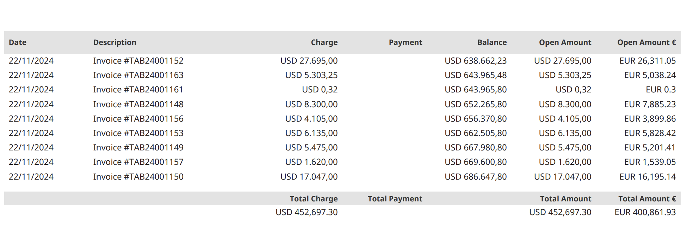

Instructions
----------------------

*   Suitelet request parameters:
    *   
    *   

*   In PDF template, Suitelet external link must be called.
    ```
    <#assign args = line.description?split("#") />
    <#assign _suiteletURL=("<suiteletExternalLink>&tranid="+args[1]+"&type="+args[0])/>
    <#include _suiteletURL />  
    ```

*   Sample value:
    ```
    var result = {"fxamountLine":"17047.00","fxamountremainingLine":"17047.00","exchangerate":"0.9500285","amount":"EUR 16,195.14","amountremaining":"EUR 0","currency":"EUR"}
    ```

*   Suitelet should write JSON string to a freemarker variable.
    ```
    scriptContext.response.write(`<#assign amountLine = ${JSON.stringify(result)} />`);
    ```

*   In PDF teemplate, **amountLine** properties are accessible.
    ```
    <#assign total_amount_base = total_amount_base + extractFloat(amountLine.amount) />
    ```

*   Sample output:
    
