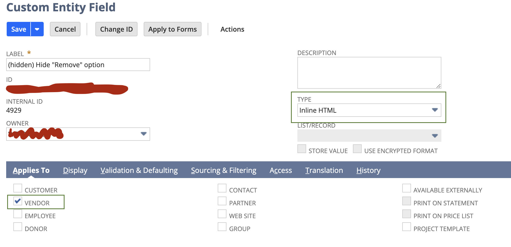

Instructions
----------------------

* **Create Custom Entity Field:**   Create a new custom entity field, and apply it on record types (in this case we are going to apply it to vendor).

    

    *   Select Field Type: **Inline HTML**
    *   Store Value = **false**
    *   In Validation/Defaulting tab:
        *   Uncheck "Formula" checkbox 
        *   Add the code into "Default Value":
            ```
                <style>
                #remove1href{
                visibility: hidden;
                display: none;
                }
                #remove2href{
                visibility: hidden;
                display: none;
                }
                #remove3href{
                visibility: hidden;
                display: none;
                }
                #remove4href{
                visibility: hidden;
                display: none;
                }
                </style>
            ```
*   **Save the custom field, and apply it to the forms.**
