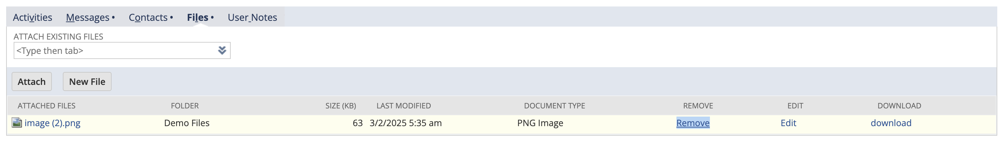
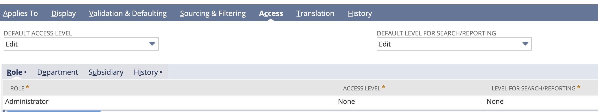

Instructions
----------------------

* Right-click on the option you would like to hide, and "inspect" html element.

    

    *   Get html ID. -> remove1href
    ```
    <td class="uir-list-row-cell listtext"><a class="dottedlink" id="remove1href" href="javascript:remove_media(12529);" onclick="setWindowChanged(window, false); ">Remove</a></td>
    ```

* **Create Custom Entity Field:**   Create a new custom entity field, and apply it on record types (in this case we are going to apply it to vendor).

    

    *   Select Field Type: **Inline HTML**
    *   Store Value = **false**
    *   In Validation/Defaulting tab:
        *   Uncheck "Formula" checkbox 
        *   Add the code into "Default Value":
            ```
                <style>
                #remove1href{
                visibility: hidden;
                display: none;
                }
                </style>
            ```

*   You may exclude administrators from this setup. To do it, keep the default access level as **Edit** and add **None** access level for "Administrator" tole.
    

*   **Save the custom field, and apply it to the forms.**

*   "Remove" option should not appear for non Administrator role.
    